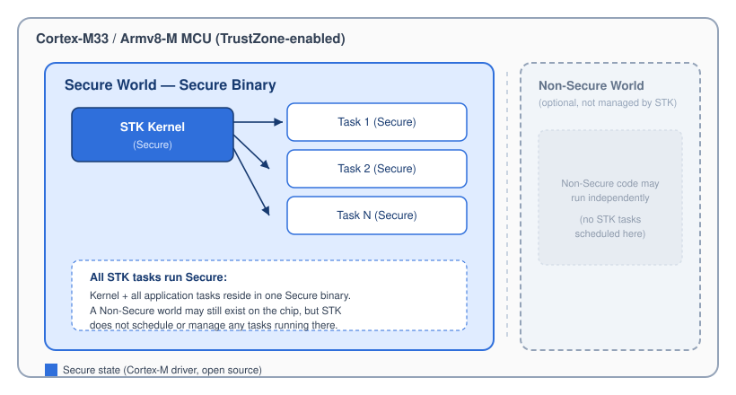
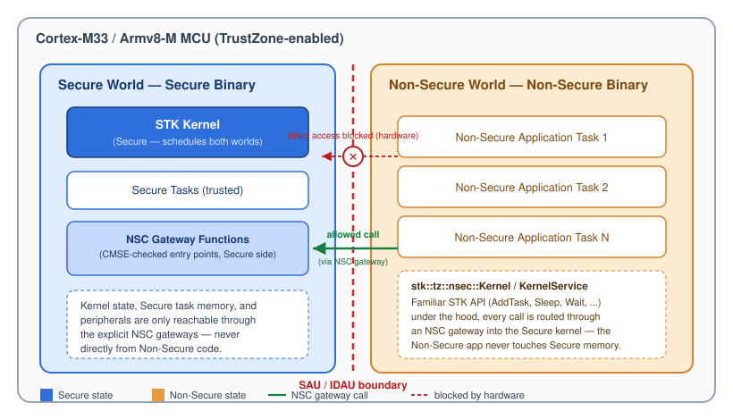
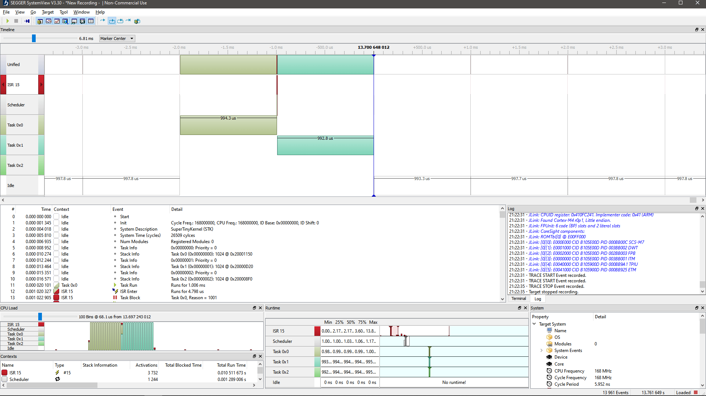

# SuperTinyKernel™ RTOS

**Lightweight High-Performance Deterministic C++ RTOS for Embedded Systems**

---

[](https://github.com/SuperTinyKernel-RTOS/stk/blob/main/LICENSE)
[](https://github.com/SuperTinyKernel-RTOS/stk/releases)
[](https://github.com/SuperTinyKernel-RTOS/stk/actions)
[](https://github.com/SuperTinyKernel-RTOS/stk)
[](https://developer.arm.com/ip-products/processors/cortex-m)
[](https://riscv.org/)
[](https://membrowse.com/public/supertinykernel-rtos/stk)

---

## Overview

**SuperTinyKernel™ RTOS** (STK) is a lightweight, deterministic real-time operating system for resource-constrained embedded systems. Instead of providing large peripheral abstraction layers (HAL), STK focuses on a highly optimized preemptive scheduler with minimal runtime overhead and a very small memory footprint.

STK combines the control and transparency of bare-metal development with the structure and maintainability of modern, type-safe C++.

You get:

- **C++ native RTOS** — Built so the C++ compiler can efficiently optimize your STK-based application for maximum speed and ultra-low overhead.
- **Safe code from day one** — Thoughtful OOP design enforces strict encapsulation and type safety to deliver secure, robust, and high-performance firmware.
- **Full-featured RTOS** — A comprehensive suite of thread synchronization, memory, and time management primitives. You only need to bring your own HAL.
- **Safety-critical ready** — Built for strict compliance with MISRA standards. Looking for a safe C++ RTOS for your certified device? Explore our [Services](#services). 
- **Deterministic execution** — Zero dynamic memory allocation (`malloc`/`free`) and zero heap fragmentation. Memory usage is fully predictable at compile time.
- **Clean C++ design** — No STL dependencies, exceptions, RTTI, or heavy runtime abstractions. Readable internals simplify debugging and tracing.
- **Verbose-free code** — A clean C++ API makes your implementation highly concise, making it significantly easier to maintain, refactor, and debug than standard C-only APIs.
- **Portable design** — Minimal BSP (Board Support Package) footprint with complete independence from specific board and MCU peripherals.
- **Reduced hardware requirements** — Compact kernel footprint that allows you to deploy on lower-RAM, lower-cost MCU variants.
- **Higher CPU availability** — More time for your application logic. Benchmarks show up to **~12% more application CPU time** compared to FreeRTOS under comparable workloads (see [Benchmark](#benchmark)).
- **Lower power consumption** — Features ultra-low power, tickless scheduling paired with reduced overhead, enabling the use of lower-frequency MCUs to save battery of your portable design.
- **Native C support** — Includes a fully featured C API wrapper, allowing you to seamlessly use STK in pure C projects.
- **Simplified migration** — Drop-in compatibility layers for FreeRTOS and CMSIS-RTOS2 to help you migrate legacy codebases with minimal application changes.
- **B2B professional support** — Engineered for seamless integration into commercial projects. Explore our [Services](#services) for enterprise-grade support and custom engineering.

> STK does not attempt to abstract or manage MCU peripherals, similarly to FreeRTOS or CMSIS-RTOS2.

STK is an open-source project developed at https://github.com/SuperTinyKernel-RTOS.

---

## Key Features

|                                           |                                                                                                                                                                                                                              |
|-------------------------------------------|------------------------------------------------------------------------------------------------------------------------------------------------------------------------------------------------------------------------------|
| **Soft real-time**                        | No strict time slots, mixed cooperative (by tasks) and preemptive (by kernel) scheduling                                                                                                                                     |
| **Hard real-time (`KERNEL_HRT`)**         | Guaranteed execution window, deadline monitoring by the kernel                                                                                                                                                               |
| **Static task model (`KERNEL_STATIC`)**   | Tasks created once at startup                                                                                                                                                                                                |
| **Dynamic task model (`KERNEL_DYNAMIC`)** | Tasks can be created and exit at runtime                                                                                                                                                                                     |
| **Rich scheduling capabilities**          | All major scheduling strategies are supported: priority-less (Round-Robin), fixed-priority, weighted (SWRR), earliest-deadline-first (EDF), and mixed-criticality adaptive (MCAS/MCAS4)                                      |
| **Mixed-criticality**                     | MCAS (2-level) and MCAS4 (4-level) adaptive strategies featuring SWRR-based group scheduling, automatic cascade escalation/recovery, and elastic CPU share adaptation driven by per-group EWMA execution-pressure estimation |
| **Tick or Tickless modes**                | Fixed-interval periodic interrupts (Tick) for simplicity, or dynamic timer-based wakeups (Tickless, `KERNEL_TICKLESS`) to maximize CPU sleep duration and power efficiency                                                   |
| **Extensible via C++ interfaces**         | Kernel functionality can be extended by implementing available C++ interfaces                                                                                                                                                |
| **Multi-core support (AMP)**              | One STK instance per physical core for optimal, lock-free performance                                                                                                                                                        |
| **Memory Protection Unit (MPU) support**  | Privileged `ACCESS_PRIVILEGED` and non-privileged tasks `ACCESS_USER`                                                                                                                                                        |
| **Low-power aware**                       | MCU enters sleep when no task is runnable (sleeping)                                                                                                                                                                         |
| **Synchronization API**                   | Rich set of primitives in `stk::sync` namespace                                                                                                                                                                              |
| **Memory API**                            | Deterministic, fragmentation-free allocator in `stk::memory` namespace                                                                                                                                                       |
| **Thread-Local Storage (TLS)**            | Per-task TLS via a dedicated CPU register via inline zero-overhead helpers                                                                                                                                                   |
| **Tiny footprint**                        | Minimal code unrelated to scheduling                                                                                                                                                                                         |
| **ARM TrustZone support**                 | Secure-only task scheduling, or Non-Secure + Secure task scheduling with kernel residing in a Secure binary                                                                                                                  |
| **Safety-critical systems ready**         | No dynamic heap memory allocation — a required baseline for IEC 61508 / ISO 26262 / DO-178C certification. See [Professional Services](#-professional-services--commercial-licensing) for certification support.             |
| **C++ and C API**                         | Can be used easily in C++ and C projects                                                                                                                                                                                     |
| **CMSIS-RTOS2 compatible**                | Full CMSIS-RTOS2 wrapper (`cmsis_os2_stk.cpp`) maps the standard ARM CMSIS-RTOS2 C API onto STK, enabling drop-in compatibility with STM32CubeMX, MCUXpresso, and other CMSIS-aware middleware                               |
| **FreeRTOS compatible**                   | Full FreeRTOS wrapper (`freertos_stk.cpp`) maps the standard FreeRTOS C API onto STK, enabling drop-in migration of existing FreeRTOS codebases with minimal or no application changes                                       |
| **Easy porting**                          | Requires very small to none BSP surface                                                                                                                                                                                      |
| **Traceable**                             | Scheduling is fully traceable with a SEGGER SystemView                                                                                                                                                                       |
| **Development mode (x86)**                | Run the same threaded application on Windows                                                                                                                                                                                 |
| **100% test coverage**                    | Every source-code line of scheduler logic is covered by unit tests                                                                                                                                                           |
| **QEMU test coverage**                    | All repository commits are automatically covered by unit tests executed on QEMU for Cortex-M and RISC-V                                                                                                                      |

---

## Modes of Operation

### Soft Real-Time (Default)

* Tasks cooperate using `Sleep()` or `Yield()`
* Timing is a best-effort
* Preemptive scheduling: tasks can not block execution of other tasks even if they do not cooperate (see **Built-in Scheduling Strategies**)
* Dedicated task switching strategies (`SwitchStrategyRoundRobin`, `SwitchStrategyFixedPriority`, `SwitchStrategySmoothWeightedRoundRobin`)

```cpp
// task is added without any time constraints
void AddTask(ITask *user_task)
```

### Hard Real-Time (HRT)

* Separate kernel mode of operation set by the `KERNEL_HRT` flag
* Periodic tasks with strict execution windows
* Tasks must notify kernel when the work is done by using `Yield()`
* Kernel enforces deadlines
* Any violation fails the application deterministically (`ITask::OnDeadlineMissed(uint32_t duration)` callback is called, where `duration` is the overrun amount in ticks)
* Dedicated HRT task switching strategies (`SwitchStrategyRoundRobin`, `SwitchStrategyRM`, `SwitchStrategyDM`, `SwitchStrategyEDF`)

```cpp
// task is added time constraints: periodicity, deadline and start delay
AddTask(ITask *user_task, Timeout periodicity_tc, Timeout deadline_tc, Timeout start_delay_tc)
```

#### Static vs Dynamic

* `KERNEL_STATIC`: tasks are created once at startup, kernel never returns to `main()`.
* `KERNEL_DYNAMIC`: tasks may exit, kernel returns to `main()` when all tasks exit.

### Tick / Tickless Context Switching

#### Tick-Based Mode (Default)

* Kernel time advances in fixed periodic interrupts (ticks)
* Hardware timer generates interrupts at a constant frequency
* Scheduler decisions are evaluated on each tick
* Simple and predictable behavior
* Suitable for systems where:
    * Timing granularity is fixed and acceptable
    * Power consumption is not critical
* Lower implementation complexity, but may introduce unnecessary CPU wakeups

#### Tickless Mode

* Separate kernel mode of operation set by the `KERNEL_TICKLESS` flag and `STK_TICKLESS_IDLE=1`
* Kernel suppresses periodic ticks and schedules timer interrupts dynamically
* Next interrupt is programmed based on the nearest upcoming event (task wakeup, deadline, etc.)
* Reduces CPU wakeups and improves power efficiency
* Especially beneficial for:
    * Low-power / battery-powered systems
    * Systems with infrequent task activity
* Maintains timing correctness while minimizing Idle overhead
* Slightly higher implementation complexity due to dynamic timer reprogramming

There are several tickless examples:
* Blinky for ARM Cortex-M MCUs: [blinky-stm32f407g-disc1](https://github.com/SuperTinyKernel-RTOS/stk/tree/main/build/example/project/eclipse/stm/blinky-stm32f407g-disc1)
* Blinky for RISC-V MCUs: [blinky-rp2350w-riscv](https://github.com/SuperTinyKernel-RTOS/stk/tree/main/build/example/project/eclipse/rpi/blinky-rp2350w-riscv)

---

### Built-in Scheduling Strategies
STK is one of the few lightweight RTOSes that offers all popular switching strategies to match any usage scenario, see [stk/strategy](https://github.com/SuperTinyKernel-RTOS/stk/tree/main/stk/include/strategy) for more details.

| Strategy Name                            | Mode       | Description                                                                                                                                                                                                                                                                                                                                                                |
|------------------------------------------|------------|----------------------------------------------------------------------------------------------------------------------------------------------------------------------------------------------------------------------------------------------------------------------------------------------------------------------------------------------------------------------------|
| `SwitchStrategyRoundRobin` / `SwitchStrategyRR` | Soft / HRT | Round-Robin scheduling strategy (Default). Each runnable task receives one time slice per tick in turn. Allows 100% CPU utilization.                                                                                                                                                                                                                                       |
| `SwitchStrategySmoothWeightedRoundRobin` / `SwitchStrategySWRR` | Soft / HRT | Smooth Weighted Round-Robin (SWRR). Distributes CPU time proportionally to per-task weights with burst-free interleaving. On each tick: every task's current weight is incremented by its static weight; the task with the highest current weight runs and then has the total weight sum deducted. Includes a wake-up priority boost to prevent I/O-bound task starvation. |
| `SwitchStrategyFixedPriority`            | Soft / HRT | Fixed-Priority Round-Robin. Tasks have fixed priorities (up to 32 levels); same-priority tasks are scheduled in Round-Robin order. Kernel supports Priority Inheritance automatically. Behavior is similar to FreeRTOS's scheduler.                                                                                                                                        |
| `SwitchStrategyRM`                       | HRT        | Rate-Monotonic (RM). Assigns fixed priorities based on task periodicity — shorter period means higher priority. Optimal among all fixed-priority policies for independent periodic tasks. Includes WCRT schedulability analysis.                                                                                                                                           |
| `SwitchStrategyDM`                       | HRT        | Deadline-Monotonic (DM). Assigns fixed priorities based on task deadlines — shorter deadline means higher priority. Generalizes RM; optimal when deadlines ≤ periods. Includes WCRT schedulability analysis.                                                                                                                                                               |
| `SwitchStrategyEDF`                      | HRT        | Earliest Deadline First (EDF). Selects the runnable task with the smallest relative deadline (`deadline − elapsed_duration`) via an O(n) linear scan each tick. Provably optimal for single-processor systems — if a feasible schedule exists, EDF will find it.                                                                                                           |
| `SwitchStrategyMCAS` 🔒                  | HRT        | Mixed-Criticality Adaptive Scheduler (2-level). SWRR within each criticality group (LO / HI) with automatic escalation to a protected HI-only mode on budget overrun. **Commercial License**                                                                                                                                                                               |
| `SwitchStrategyMCAS4` 🔒                 | HRT        | Mixed-Criticality Adaptive Scheduler (4-level). Extends MCAS with four criticality levels, cascade escalation/recovery, and elastic CPU share adaptation via per-group EWMA pressure estimation. **Commercial License**                                                                                                                                                    |
| **Custom**                               | Soft / HRT | Custom algorithm implemented via the `ITaskSwitchStrategy` interface. By implementing the `ITaskSwitchStrategy` interface you can provide your own unique scheduling strategy without changing anything inside the kernel.                                                                                                                                                 |

> 🔒 Commercial strategies are available to commercial licensees. See the bottom of `README.md` for contact details.

---

### Task Privilege Separation

Starting with ARM Cortex-M3 and all newer cores (M3/M4/M7/M33/M55/...) that implement the Armv7-M or Armv8-M architecture with the **Memory Protection Unit (MPU)**, STK supports explicit privilege separation between tasks.

| Access Mode                                                                      | Privileged (`ACCESS_PRIVILEGED`)                            | Unprivileged (`ACCESS_USER`)                                       |
|----------------------------------------------------------------------------------|-------------------------------------------------------------|--------------------------------------------------------------------|
| CPU privilege level                                                              | Runs in **Privileged Thread Mode**                          | Runs in **Unprivileged Thread Mode**                               |
| Direct peripheral access                                                         | Allowed (normal register/bit-band access)                   | Blocked by the hardware (BusFault on any peripheral access)        |
| Ability to call SVC / trigger PendSV                                             | Yes                                                         | No (but STK services allow Sleep, Delay, Yield, CS, ...)           |
| Ability to execute privileged instructions (CPS, MRS/MSR for control regs, etc.) | Yes                                                         | No                                                                 |
| Typical use case                                                                 | Drivers, hardware abstraction, critical infrastructure code | Application logic, protocol parsers, third-party or untrusted code |

Modern embedded systems increasingly process untrusted or complex data (network/USB packets, sensor data, firmware updates, etc.). By marking tasks that parse potentially attacker-controlled data as `ACCESS_USER`, you get **hardware-enforced isolation**:
- An erroneous or malicious write to a peripheral register immediately triggers a **hard BusFault** instead of silently corrupting hardware state.
- Only explicitly trusted tasks (marked `ACCESS_PRIVILEGED`) are allowed to touch GPIO, UART, SPI, DMA, timers, etc.
- The kernel itself and all STK services remain fully functional for unprivileged tasks (`Sleep`, `Yield`, `CriticalSection`, TLS, etc.).

#### Example

```cpp
// Trusted driver task – needs direct hardware access
class DriverTask : public stk::Task<256, ACCESS_PRIVILEGED> { ... };

// Application task that parses USB or network data – runs unprivileged
class ParserTask : public stk::Task<512, ACCESS_USER> { ... };
```

---

### ARM TrustZone Support

On ARMv8-M cores with **ARM TrustZone** (Cortex-M23/M33/M35P/M55/M85 and other Armv8-M/Armv8.1-M implementations), STK can run split across the Secure and Non-Secure worlds, giving your application hardware-enforced isolation on top of the scheduler itself.

The open-source Cortex-M architecture driver (`stk_arch_arm-cortex-m.cpp`) already implements the core, low-level TrustZone plumbing needed to run STK on a Secure/Non-Secure split system:
* Saving and restoring the additional Secure-state register frame (`PSPLIM`, `PSPLIM_NS`, `PSP_NS`, `CONTROL_NS`) on every context switch, so a task can be interrupted and resumed transparently regardless of whether it was executing Secure or Non-Secure code at the time.
* Secure/Non-Secure FPU lazy-stacking setup (CP10/CP11 access for both states).
* Detecting which security state a task was running in (S-bit) when a context switch occurs.

This is enough to build a **Secure-only** system, where the kernel and all tasks it schedules reside entirely in the Secure binary. A Non-Secure image may still exist and run on the chip (e.g. bootloader-provided or third-party Non-Secure code) — STK simply does not schedule, wrap, or otherwise manage any tasks running there.

The **full-featured TrustZone interface** — enabling a proper split system where the kernel lives in the Secure binary and schedules both Secure *and* Non-Secure tasks — is available under the [commercial license](#-professional-services--commercial-licensing). This interface (`stk_arch_arm-tz.h` / `stk_arch_arm-tz.cpp`) provides:
* CMSE (`ARM_CMSE`)-based Non-Secure callable (NSC) gateway functions exposing kernel services (`AddTask`, `RemoveTask`, `SuspendTask`, `ResumeTask`, `Sleep`, `Delay`, `Wait`, `GetTid`, `GetTicks`, critical sections, spinlocks, etc.) to the Non-Secure world.
* Lightweight `ITask`/`ISyncObject`/`IMutex` wrapper structures (`CmseITaskWrapper`, `CmseISyncObjectWrapper`, `CmseIMutexWrapper`) that bridge Non-Secure task objects and synchronization primitives across the security boundary, so a Non-Secure task looks and behaves like a regular STK task to the Secure-side scheduler.
* A drop-in Non-Secure `stk::tz::nsec::Kernel` / `KernelService` facade, so Non-Secure application code uses the same familiar STK API (`AddTask`, `Start`, `Sleep`, `Wait`, ...) without needing to know it is actually calling across the Secure boundary.

#### Two supported deployment models

| Model                                     | Description                                                                                                                                                                                                                                                                                                                                                                                                                                                                                    |
|-------------------------------------------|------------------------------------------------------------------------------------------------------------------------------------------------------------------------------------------------------------------------------------------------------------------------------------------------------------------------------------------------------------------------------------------------------------------------------------------------------------------------------------------------|
| **Secure-only**                           | The STK kernel and all its tasks reside in the Secure binary. A Non-Secure world may be present and running on the chip, but STK does not schedule or manage any tasks in it — only Secure tasks are ever scheduled. Achievable with the open-source Cortex-M driver alone.                                                                                                                                                                                                                    |
| **Non-Secure + Secure (full protection)** | The STK kernel and its trusted tasks reside in the **Secure** binary, while application tasks run in a separate **Non-Secure** binary. The kernel schedules both worlds, but Non-Secure code can only reach the kernel through explicit, CMSE-checked NSC gateway functions — it can never call into, inspect, or corrupt Secure-side kernel state or Secure task memory directly. Requires the [commercial](#services) full-featured TrustZone interface, or you can freely develop your own. |

> 🔒 Commercial STK Interface for ARM TrustZone is available to commercial licensees for faster time-to-market development. See the bottom of `README.md` for [contact details](#services).

**Secure-only:** kernel and all scheduled tasks live in one Secure binary. A Non-Secure world may exist on the chip, but STK does not schedule any tasks there.



**Non-Secure + Secure (full protection):** the Secure kernel schedules both worlds, but Non-Secure tasks can only reach it through CMSE-checked NSC gateway functions — direct access to Secure memory or kernel state is blocked by hardware.



In the Non-Secure + Secure model, the Non-Secure application is **fully protected from the Secure world's perspective**: hardware (SAU/IDAU + MPU) prevents Non-Secure code from ever accessing Secure memory or peripherals, while the kernel itself lives entirely on the trusted, Secure side — so a compromised or buggy Non-Secure task can, at worst, disrupt only the Non-Secure world, never the Secure kernel or Secure tasks.

#### Examples

Ready-to-try TrustZone examples for the Raspberry Pi Pico 2 W (RP2350, Cortex-M33):
* `build/example/blinky-trustzone-ns` — Non-Secure application example
* `build/example/blinky-trustzone-sc` — Secure application example
* `build/example/project/eclipse/rpi/blinky-trustzone-ns-rp2350w` — ready-to-import Eclipse project (Non-Secure side)
* `build/example/project/eclipse/rpi/blinky-trustzone-sc-rp2350w` — ready-to-import Eclipse project (Secure side)

---

### Multi-Core Support

STK supports multicore embedded microcontrollers (e.g., ARM Cortex-M55, dual-core Cortex-M33/M7/M0, or multicore RISC-V devices) through a **per-core instance model** (Asymmetric Multi-Processing). 

AMP design delivers maximum performance while keeping STK kernel extremely lightweight:

| Feature                    | Description                                                                              |
|----------------------------|------------------------------------------------------------------------------------------|
| Zero intercore overhead    | No cross-core communication inside STK itself                                            |
| Minimal latency            | Scheduling decisions are local to the core                                               |
| Full cache efficiency      | All kernel data structures stay in the local core’s L1 cache                             |
| Independent timing domains | One core can run hard real-time tasks while another runs soft real-time or dynamic tasks |
| Simple and predictable     | No complex SMP synchronization logic required in the kernel                              |
| No core congestion         | Highest possible performance and deterministic timing on each individual core            |

STK provides a rich set of synchronization primitives (see [stk/sync](https://github.com/SuperTinyKernel-RTOS/stk/tree/main/stk/include/sync)) which are suitable for multicore synchronization with multiple STK instances.

#### Usage Example (Dual-Core System)

```cpp
void start_core0()
{
    // Core 0 – Real-time control tasks
    static stk::Kernel<KERNEL_STATIC, 8, stk::SwitchStrategyRoundRobin, PlatformDefault> kernel_core0;

    kernel_core0.Initialize(PERIODICITY_1MS); // Hard real-time tick
    kernel_core0.AddTask(&motor_control_task);
    kernel_core0.AddTask(&sensor_task);
    // ...
    kernel_core0.Start();
}

void start_core1()
{
    // Core 1 – Communication & logging tasks
    static stk::Kernel<KERNEL_DYNAMIC, 6, stk::SwitchStrategyRoundRobin, PlatformDefault> kernel_core1;

    kernel_core1.Initialize(PERIODICITY_10MS); // Softer timing
    kernel_core1.AddTask(&ethernet_task);
    kernel_core1.AddTask(&logging_task);
    // ...
    kernel_core1.Start();
}
```

There is a dual-core example for Raspberry Pico 2 W board with RSP2350 MCU in `build/example/project/eclipse/rpi/blinky-smp-rp2350w` directory.

---

### Ultra-Low Power Scheduling

STK provides a first-class ultra-low power scheduling mode that goes beyond simple tickless idle. By combining `KERNEL_TICKLESS` with a custom `stk::IPlatform::IEventOverrider`, the application can select the deepest appropriate hardware sleep state on each idle entry with full kernel suspension and graceful resume support.

#### How It Works

When all tasks are sleeping, the kernel calls `IEventOverrider::OnSleep(sleep_ticks)` instead of spinning. The application overrides this hook to drive the MCU into the most power-efficient state that still guarantees a wake-up within the required deadline.

```cpp
bool OnSleep(stk::Timeout sleep_ticks) override
{
    if (sleep_ticks >= TICKS_DEEP_SLEEP)
    {
        stk::IKernelService *kernel = stk::IKernelService::GetInstance();

        Board::RtcWakeupArm(sleep_ticks);   // 1. arm RTC wakeup timer
        kernel->Suspend();                  // 2. stop SysTick / task switching
        Board::AdcSuspend();                // 3. cut ADC quiescent current
        Board::CpuEnterDeepSleepMode();     // 4+5. STOP + restore HSE/PLL
        Board::RtcWakeupDisarm();           // 6. clear RTC & EXTI flags
        Board::AdcResume();                 // 7. re-enable ADC
        kernel->Resume(sleep_ticks);        // 8. advance kernel clock

        return false; // let the driver re-enter idle; SysTick closes the gap
    }
    // ...
}
```

#### Graceful Kernel Suspension and Resume

STK supports **ISR-safe** kernel suspension, allowing an interrupt handler to pause and resume all task scheduling without race conditions. This is useful for entering a low-activity state (e.g. user-triggered standby) where tasks should be fully frozen until an external event occurs.

```cpp
// In an ISR (e.g. button press — EXTI0_IRQHandler):
stk::IKernelService *kernel = stk::IKernelService::GetInstance();

// Suspend: returns ticks until the nearest scheduled wake-up.
// All task switching and SysTick firings are frozen.
kernel->Suspend();

// ... CPU can now enter deep sleep indefinitely (no RTC timer armed) ...
// ... Only an external IRQ (e.g. button EXTI) will wake the CPU ...

// Resume: pass 0 when the sleep duration is unknown (e.g. waking from
// indefinite suspension is analogous to restoring from hibernation).
kernel->Resume(0);
```

#### Full Example

A complete ultra-low power demo targeting the [STM32F407G-DISC1](https://www.st.com/en/evaluation-tools/stm32f4discovery.html) board is available:

[`STK C++ API low_power`](https://github.com/SuperTinyKernel-RTOS/stk/tree/main/build/example/low_power/README.md)

[`STK C API low_power_c`](https://github.com/SuperTinyKernel-RTOS/stk/tree/main/build/example/low_power_c/README.md)

---

## Hardware Support

### CPU Architectures

* ARM Cortex-M (ARMv6-M, ARMv7-M, ARMv7E-M, ARMv8-M, ARMv8.1-M)
* RISC-V RV32I (RV32IMA_ZICSR)
* RISC-V RV32E (RV32EMA_ZICSR) — including very small RAM devices

### Floating-point

* Soft
* Hard

---

## Dependencies

* CMSIS (ARM platforms only)
* MCU vendor BSP (RPI only)

> **Note:** A minimal set of CMSIS/BSP API is used by STK.

---

## Compiler

* GCC
* Clang/ARMCC 6 and higher
* IAR EWARM 8.0 and higher (ARM only)

---

## Language

* Minimal: C++11
* Recommended: C++17 and higher

---

## Dedicated C interface

For seamless integration with C projects, STK provides a dedicated, fully-featured C API. See [interop/c](https://github.com/SuperTinyKernel-RTOS/stk/tree/main/interop/c) for the full reference and examples.

**Quick example:**

```c
#include <stk_c.h>

#define STACK_WORDS 256
static stk_word_t g_stack0[STACK_WORDS];
static stk_word_t g_stack1[STACK_WORDS];

void task_led(void *arg)
{
    while (1)
    {
        /* toggle LED */
        stk_sleep_ms(500);
    }
}

void task_sensor(void *arg)
{
    while (1)
    {
        /* read sensor */
        stk_sleep_ms(100);
    }
}

int main(void)
{
    stk_kernel_t *k = stk_kernel_create(0);       /* core 0 */
    stk_kernel_init(k, STK_PERIODICITY_DEFAULT);  /* 1 ms tick */

    stk_task_t *t0 = stk_task_create_privileged(task_led,    NULL, g_stack0, STACK_WORDS);
    stk_task_t *t1 = stk_task_create_privileged(task_sensor, NULL, g_stack1, STACK_WORDS);

    stk_kernel_add_task(k, t0);
    stk_kernel_add_task(k, t1);

    stk_kernel_start(k);                          /* never returns for KERNEL_STATIC */
    STK_C_ASSERT(false);                          /* should not reach here */
}
```

---

## Migrating from CMSIS-RTOS2 or FreeRTOS

STK ships two ready-made compatibility wrappers that let you swap out your existing RTOS backend and replace it with STK without rewriting application code. Both wrappers live under `interop/` and share the same design principles: thin translation of the source API onto STK primitives, ISR-safe where the original API requires it, and zero heap usage when the caller supplies static memory.

### CMSIS-RTOS2 Wrapper (`interop/cmsis/rtos2`)

STK provides a complete **CMSIS-RTOS2** compatibility layer (`cmsis_os2_stk.cpp`) that maps the standard ARM [CMSIS-RTOS2 C API](https://arm-software.github.io/CMSIS_6/latest/RTOS2/group__CMSIS__RTOS.html) (`cmsis_os2.h` **v2.3.0**) onto the STK C++ kernel. This allows you to use STK as a drop-in RTOS backend in any project that targets the CMSIS-RTOS2 interface, including code generated by STM32CubeMX, MCUXpresso, or any other CMSIS-aware IDE or middleware stack.

**Covered API groups:** Kernel Management, Thread Management, Thread Flags, Event Flags, Mutex, Semaphore, Timer, Message Queue, Memory Pool.

**Quick integration:**

```make
# 1. Add wrapper source
SRCS     += libs/stk/interop/cmsis/rtos2/src/cmsis_os2_stk.cpp

# 2. Add include paths
INCLUDES += -Ilibs/stk/include
INCLUDES += -Ilibs/stk/interop/cmsis/rtos2/include
```

```c
// 3. No application changes required — existing CMSIS-RTOS2 calls work as-is
#include "cmsis_os2.h"

int main(void)
{
    osKernelInitialize();
    osThreadNew(app_thread, NULL, NULL);
    osKernelStart();   // never returns
}
```

See [interop/cmsis/rtos2](https://github.com/SuperTinyKernel-RTOS/stk/tree/main/interop/cmsis/rtos2) for the full API coverage table, design notes, and configuration macros.

---

### FreeRTOS Wrapper (`interop/freertos`)

STK provides a complete **FreeRTOS** compatibility layer (`freertos_stk.cpp`) that maps the standard FreeRTOS C API onto the STK C++ kernel. Existing FreeRTOS projects can migrate to STK with minimal or no changes to application code, while immediately gaining STK's lower scheduling overhead, reduced jitter, and smaller RAM footprint (see [Benchmark](#benchmark) above).

**Covered API groups:** Kernel Control, Task Management, Queue, Semaphore / Mutex, Software Timers, Event Groups, Task Notifications.

**Quick integration:**

```make
# 1. Add wrapper source
SRCS     += libs/stk/interop/freertos/src/freertos_stk.cpp

# 2. Add include paths
INCLUDES += -Ilibs/stk/include
INCLUDES += -Ilibs/stk/interop/freertos/include
```

```c
// 3. No application changes required — existing FreeRTOS calls work as-is
#include "FreeRTOS.h"
#include "task.h"

int main(void)
{
    xTaskCreate(app_task, "app", 256, NULL, 2, NULL);
    vTaskStartScheduler();   // never returns
}
```

See [interop/freertos](https://github.com/SuperTinyKernel-RTOS/stk/tree/main/interop/freertos) for the full API coverage table, design notes, known limitations, and `FreeRTOSConfig.h` requirements.

---

### Wrapper Comparison

|                     | CMSIS-RTOS2                                     | FreeRTOS                                          |
|---------------------|-------------------------------------------------|---------------------------------------------------|
| Source file         | `cmsis_os2_stk.cpp`                             | `freertos_stk.cpp`                                |
| Header to include   | `cmsis_os2.h`                                   | `FreeRTOS.h`, `task.h`                            |
| Priority model      | Linear map: `osPriority` 1–56 → STK levels 0–31 | Direct clamp: FreeRTOS 0–N → STK levels 0–31      |
| Max tasks macro     | `CMSIS_STK_MAX_THREADS` (default: 16)           | `FREERTOS_STK_MAX_TASKS` (default: 16)            |
| Default stack macro | `CMSIS_STK_DEFAULT_STACK_WORDS` (default: 256)  | `FREERTOS_STK_DEFAULT_STACK_WORDS` (default: 256) |
| Static allocation   | `cb_mem` / `cb_size` attributes                 | `xTaskCreateStatic` / `xQueueCreateStatic`        |
| Scheduler backend   | `SwitchStrategyFP32`                            | `SwitchStrategyFP32`                              |
| Tickless support    | `STK_TICKLESS_IDLE=1`                           | `STK_TICKLESS_IDLE=1`                             |


> **Note:** Wrapper is missing important API your project is using? Contact with inquiry: [contact@supertinykernel.org](mailto:contact@supertinykernel.org)

---

## Synchronization API (`stk/stk_sync.h`)

STK provides a feature-rich synchronization API which is located in [stk/sync](https://github.com/SuperTinyKernel-RTOS/stk/tree/main/stk/include/sync) and resides in a dedicated namespace `stk::sync`. It is a high-performance framework designed for both single-core and multicore embedded systems and provides a robust mechanism for inter-task and inter-core communication.

| Primitive                    | Description                                                                                                                                                                                                                                                                           |
|------------------------------|---------------------------------------------------------------------------------------------------------------------------------------------------------------------------------------------------------------------------------------------------------------------------------------|
| `hw::CriticalSection`        | Low-level primitive (including RAII version `hw::CriticalSection::ScopedLock`) that ensures atomicity by preventing preemption. Always available and independent of `KERNEL_SYNC` mode.                                                                                               |
| `hw::SpinLock`               | High-performance non-recursive primitive for short critical sections. A key primitive for inter-core synchronization. Always available and independent of `KERNEL_SYNC` mode.                                                                                                         |
| `sync::ScopedCriticalSection`| RAII wrapper around `hw::CriticalSection` (disables interrupts + multicore guard). Used as a building brick by all other `stk::sync` primitives. Always available, independent of `KERNEL_SYNC` mode.                                                                                 |
| `sync::ConditionVariable`    | Monitor-pattern signaling used with an `IMutex`-compatible lock. Atomically releases the lock and blocks the caller; re-acquires it on wake. Supports `Wait()`, `NotifyOne()`, and `NotifyAll()`.                                                                                     |
| `sync::Event`                | Binary state-based signaling object. Supports manual-reset (wake all) and auto-reset (wake one) modes. Also provides `Pulse()` (Win32-compatible semantics) and non-blocking `TryWait()`.                                                                                             |
| `sync::EventFlags`           | 32-bit multi-flag synchronization group. Each bit is an independent event; tasks can wait for any one (`OPT_WAIT_ANY`) or all (`OPT_WAIT_ALL`) requested bits. Matched bits are auto-cleared on wake; pass `OPT_NO_CLEAR` to keep them set. ISR-safe `Set()`, `Clear()`, and `Get()`. |
| `sync::Mutex`                | Recursive mutual exclusion primitive. Tracks ownership and recursion depth; the same task may lock multiple times. Ownership transfers directly to the first waiter (FIFO) on `Unlock()`.                                                                                             |
| `sync::RWMutex`              | Reader-Writer Lock for shared (read) and exclusive (write) access. Implements a Writer Preference policy to prevent writer starvation. Provides RAII guards `ScopedTimedLock` and `ScopedTimedReadMutex`.                                                                             |
| `sync::SpinLock`             | High-performance recursive spinlock for very short critical sections where context-switch overhead is unacceptable. Busy-waits until the lock is free; ISR-unsafe (use `hw::CriticalSection` from ISR context).                                                                       |
| `sync::Semaphore`            | Counting semaphore for resource throttling and signaling. Features a Direct Handover policy: `Signal()` passes the token directly to the first waiting task without touching the internal counter.                                                                                    |
| `sync::Pipe`                 | Thread-safe typed FIFO ring buffer for inter-task data passing. Parameterised on element type `T` and capacity `N`. Supports blocking and non-blocking single-element and bulk (`WriteBulk` / `ReadBulk`) I/O with zero dynamic memory allocation.                                    |
| `sync::MessageQueue`         | Fixed-capacity, fixed-message-size FIFO queue backed by a caller-supplied byte buffer. Parameterised on a byte count rather than a type, making it suitable for C-ABI structs or heterogeneous payloads.                                                                              |
| Custom                       | Extensible: any class inheriting from `ISyncObject` can implement custom synchronization logic integrated with the kernel scheduler.                                                                                                                                                  |

> **Note:** Synchronization can be enabled in the kernel selectively by adding `KERNEL_SYNC` flag. If application does not need `sync` primitives and `KERNEL_SYNC` is not set to the kernel then synchronization-related implementation is stripped by the compiler saving FLASH and RAM.

---

## Memory API (`stk/stk_memory.h`)

STK provides a deterministic, fragmentation-free memory allocation module located in [stk/memory](https://github.com/SuperTinyKernel-RTOS/stk/tree/main/stk/include/memory) under the `stk::memory` namespace. It is designed for embedded systems where dynamic heap allocation is undesirable or prohibited by coding standards (e.g. MISRA C++ Rule 18-4-1).

### `memory::BlockMemoryPool`

A fixed-size block allocator for scenarios where the same block size is repeatedly allocated and released, such as: packet buffers, sensor records, or message payloads.

Internally the pool maintains an intrusive singly-linked free-list inside the storage array itself. No separate metadata array is required, alloc and free are therefore O(1) with a minimal critical section.

**Key properties:**

- **Zero fragmentation**: fixed block size eliminates heap fragmentation over any run duration.
- **O(1) alloc and free**: constant-time operation with minimal critical section.
- **Typed wrappers**: `AllocT<T>()` / `TryAllocT<T>()` eliminate manual casts and assert type–size compatibility at allocation time.
- **Debug diagnostics**: double-free detection (O(n) free-list walk), bounds checking, and alignment validation in debug builds; all checks compile away in release.
- **Non-copyable, non-movable**: safe for use as a global or static object.

---

## Traceable by SEGGER SystemView

Scheduling can be analyzed with the [SEGGER SystemView](https://www.segger.com/products/development-tools/systemview).

There is a ready to try Blinky example with SEGGER SystemView tracing enabled: `build/example/project/eclipse/stm/blinky-stm32f407g-disc1-segger`



---

## Development Mode (x86)

STK includes a full scheduling emulator for Windows to speed up a prototype development:
* Run the same embedded application on x86
* Debug threads using Visual Studio or Eclipse
* Perform unit testing without hardware
* Mock or simulate peripherals

---

## Test Boards

STK has been tested on the following development boards:

* STM STM32F0DISCOVERY (Cortex-M0)
* STM NUCLEO-F103RB (Cortex-M3)
* NXP FRDM-K66F (Cortex-M4F)
* STM STM32F4DISCOVERY (Cortex-M4F)
* NXP MIMXRT1050 EVKB (Cortex-M7)
* Raspberry Pi Pico 2 W (Cortex-M33 / RISC-V variant)

> **Note:** The list of tested boards does not limit STK’s compatibility. STK does not depend on a specific board and relies only on the underlying CPU architecture. As long as target CPU is supported, STK can be integrated with your hardware platform.

---

## Test Coverage

| Coverage                  | Description                                       |
|---------------------------|---------------------------------------------------|
| Platform-independent code | 100% unit test coverage                           |
| Platform-dependent code   | tested under QEMU for each supported architecture |

---

## Benchmark

Board: **STM32F407G-DISC1**, MCU: **STM32F407VG** (Cortex-M4 168MHz)

Update: **April 2026**

Compiler: **GCC 14.2.1 (arm-none-eabi-gcc)**

This table compares **SuperTinyKernel RTOS v.1.06.0** and **FreeRTOS V11.2.0** across two compiler optimization levels: `-Os` and `-Ofast`. The workload consists of a CRC32-based synthetic task running across multiple tasks/threads to measure scheduling overhead and timing determinism. Benchmark projects are located in `build/benchmark/eclipse` and the benchmark suite is located in `build/benchmark/perf`.

The benchmark suite uses CRC32 hash calculations as the task payload. The score represents the number of CRC32 calculations performed by the task within a fixed time window. A higher score indicates a more efficient scheduler, meaning the tasks have more available CPU time.

### Benchmark Results: STK vs. FreeRTOS (Cortex-M4 168MHz)

| Kernel       | Tasks  |   Opt    | Throughput  |   Average   | Jitter  | Flash Size  |  RAM Used   |
|:-------------|:------:|:--------:|:-----------:|:-----------:|:-------:|:-----------:|:-----------:|
| **STK**      |   16   | `-Ofast` | **993,008** | **62,063**  | **754** |   24.1 KB   | **20.3 KB** |
| **FreeRTOS** |   16   | `-Ofast` |   966,017   |   60,376    |   909   | **15.0 KB** |   22.2 KB   |
| **STK**      |   16   |  `-Os`   | **752,136** | **47,008**  | **425** |   14.9 KB   | **20.3 KB** |
| **FreeRTOS** |   16   |  `-Os`   |   735,342   |   45,958    |   472   | **12.6 KB** |   22.2 KB   |
| ---          |  ---   |   ---    |     ---     |     ---     |   ---   |     ---     |     ---     |
| **STK**      |   8    | `-Ofast` | **988,862** | **123,607** |   866   |   23.0 KB   | **11.4 KB** |
| **FreeRTOS** |   8    | `-Ofast` |   932,654   |   116,581   | **613** | **14.4 KB** |   13.3 KB   |
| **STK**      |   8    |  `-Os`   | **753,013** | **94,126**  |   659   |   14.9 KB   | **11.4 KB** |
| **FreeRTOS** |   8    |  `-Os`   |   713,292   |   89,161    | **468** | **12.6 KB** |   13.2 KB   |
| ---          |  ---   |   ---    |     ---     |     ---     |   ---   |     ---     |     ---     |
| **STK**      |   4    | `-Ofast` | **989,465** | **247,366** |   742   |   22.1 KB   | **6.9 KB**  |
| **FreeRTOS** |   4    | `-Ofast` |   881,082   |   220,270   | **671** | **14.5 KB** |   8.8 KB    |
| **STK**      |   4    |  `-Os`   | **753,459** | **188,364** |   564   |   14.9 KB   | **6.9 KB**  |
| **FreeRTOS** |   4    |  `-Os`   |   673,845   |   168,461   | **510** | **12.6 KB** |   8.8 KB    |

### Conclusion

* **Throughput:** STK consistently outperforms FreeRTOS, delivering **~12% more computational work** in direct head-to-head benchmarks. Furthermore, STK scales exceptionally well with aggressive compiler optimizations, yielding a **31% performance boost** when moving from size-optimized (`-Os`) to speed-optimized (`-Ofast`) configurations.
* **Scheduling Overhead:** STK demonstrates exceptional scaling stability. Total throughput remains remarkably flat regardless of task count, indicating near-zero context-switching friction even as the system reaches 16 concurrent threads.
* **Determinism:** For timing-critical applications, STK is the superior choice. In high-load scenarios (16 tasks at `-Ofast`), STK provides **~17% lower jitter** than FreeRTOS, ensuring the precise temporal alignment required for time-sensitive tasks.
* **Resource Efficiency:** STK achieves a class-leading RAM footprint, utilizing **~21% less RAM** than FreeRTOS in 4-task scenarios and maintaining an **~8.5% RAM advantage** at 16 tasks.

---

## Quick Start (1 minute)

The fastest way to evaluate STK is to build and run one of the bundled examples on your local machine — **no hardware required**.

**Prerequisites:** Git, CMake 3.15+, and either Visual Studio (Windows) or GCC via Eclipse CDT (Windows/Linux/macOS).

### 1. Clone repository

```bash
git clone https://github.com/SuperTinyKernel-RTOS/stk.git
cd stk
```

### 2. Build example for x86 development mode

You can build and run examples **without any hardware** on Windows.

with Visual Studio:

```bash
cd build/example/project/msvc
```
* `blinky` – emulates toggling of Red, Green, Blue LEDs
* `critical_section` – demonstrates support for Critical Section synchronization primitive
* `tls` - demonstrates the use of Thread-local storage (TLS)

with Eclipse CDT:

```bash
cd build/example/project/eclipse
```
* `blinky-mingw32` – emulates toggling of Red, Green, Blue LEDs

To import project into Eclipse workspace:

```
File → Import... → Existing Projects into Workspace → Select root directory → Browse... → build/example/project/eclipse/blinky-mingw32
```

### 3. Run on a hardware

* Import the STM32, RPI (Raspberry Pico) or NXP example in Eclipse CDT IDE or MCUXpresso IDE
* Example folders provide Eclipse `.launch` files for launching on QEMU, Segger J-Link, OpenOCD 
* Build and flash your target MCU

---

## Building and Running Examples

> You can use your own tools, below specified tools are just for a quick evaluation of STK's functionality using the provided examples.

### Required tools for building examples

For STM32, RPI platforms:
* Eclipse Embedded CDT
* xPack GNU ARM Embedded GCC
* xPack QEMU ARM emulator

For NXP platforms:
* MCUXpresso IDE (includes GCC)

For RISC-V platforms:
* xPack GNU RISC-V Embedded GCC
* xPack QEMU RISC-V

> If you are targeting only ARM, RISC-V tools are not required.

### Examples

All examples are located in `build/example/project/eclipse` folder.

Examples are grouped by platform:
* `stm` – STM32, for QEMU or hardware
* `rpi` – Raspberry Pico
* `risc-v` - RISC-V, for QEMU or hardware
* `x86` – Windows emulator

#### Import into Eclipse CDT

```
File → Import... → Existing Projects into Workspace → Select root directory → build/example/project/eclipse
```

STM32 and Raspberry Pico examples include SDK files located in `deps/target` folder.

#### NXP Examples

Located in `build/example/project/nxp-mcuxpresso` folder.

Compatible with:
* Kinetis K66/K26
* i.MX RT1050
* other compatible NXP MCUs with ARM Cortex-M0/M3/M4/M7/M33/...

---

#### Example Code

Below example toggles RGB LEDs on a development board. Each LED is controlled by its own thread, switching at 1s intervals:

```cpp
#include <stk.h>
#include <sync/stk_sync_eventflags.h>

using namespace bsp;

enum { TASK_STACK_SIZE = 256 };

static const uint32_t FLAGS_ALL[] = {
    (1U << LED_RED),
    (1U << LED_ORANGE),
    (1U << LED_GREEN),
    (1U << LED_BLUE)
};
static stk::sync::EventFlags g_TaskFlags(FLAGS_ALL[LED_RED]);
static stk::Ticks g_Timeline = 0;

template <stk::EAccessMode _AccessMode>
class MyTask : public stk::Task<TASK_STACK_SIZE, _AccessMode>
{
    uint8_t  m_task_id;
    uint32_t m_my_flag;
    uint32_t m_next_flag;

public:
    MyTask(uint8_t task_id) : m_task_id(task_id), m_my_flag(FLAGS_ALL[task_id]),
          m_next_flag(FLAGS_ALL[(task_id + 1) % LED_MAX])
    {}

private:
    void Run() override
    {
        const stk::Timeout period = stk::GetTicksFromMs(1000);
        g_Timeline = stk::GetTicks();

        while (true)
        {
            uint32_t result = g_TaskFlags.Wait(m_my_flag, stk::sync::EventFlags::OPT_WAIT_ANY);
            if (stk::sync::EventFlags::IsError(result))
                continue;

            {
                stk::hw::CriticalSection::ScopedLock __guard;
                Led::SwitchOnExclusive(static_cast<LedId>(m_task_id));
            }

            stk::SleepUntil(g_Timeline += period);

            g_TaskFlags.Set(m_next_flag);
        }
    }
};

void RunExample()
{
    using namespace stk;

    Led::InitAll(false);

    const uint8_t KernelMode = KERNEL_STATIC | KERNEL_SYNC | (STK_TICKLESS_IDLE ? KERNEL_TICKLESS : 0);

    static Kernel<KernelMode, 4, SwitchStrategyRR, PlatformDefault> kernel;

    static MyTask<ACCESS_PRIVILEGED> task1(LED_RED);
    static MyTask<ACCESS_PRIVILEGED> task2(LED_ORANGE);
    static MyTask<ACCESS_PRIVILEGED> task3(LED_GREEN);
    static MyTask<ACCESS_PRIVILEGED> task4(LED_BLUE);

    kernel.Initialize();

    kernel.AddTask(&task1);
    kernel.AddTask(&task2);
    kernel.AddTask(&task3);
    kernel.AddTask(&task4);

    kernel.Start();

    STK_ASSERT(false);
}
```

---

## Adding STK to your project

### Add using Git & CMake:

#### 1. Clone STK into your project

You can include STK in your project using `git submodule` or by copying the source into a `libs/` or `third_party/` folder:
```bash
# Example: using git submodule
cd your-project
git submodule add https://github.com/SuperTinyKernel-RTOS/stk.git libs/stk_rtos
git submodule update --init
```

#### 2. Modify your `CMakeLists.txt`

Add the STK directory and link against STK:
```cmake
# In your project CMakeLists.txt

# 1. Add STK as a subdirectory
add_subdirectory(libs/stk_rtos/stk)

# 2. Link STK into your executable or firmware target
target_link_libraries(your_firmware_target PUBLIC stk)

# 3. Include STK headers
target_include_directories(your_firmware_target
    PUBLIC
    ${CMAKE_SOURCE_DIR}/libs/stk_rtos/stk/include
)
```

#### 3. Build

Run your normal build procedure. STK will now be compiled and linked with your project.

#### 4. Initialize STK in your code

```cpp
#include "stk.h"
// ...
static Kernel<KERNEL_STATIC, 3, SwitchStrategyRoundRobin, PlatformDefault> kernel;
// add tasks, start scheduling …
```

#### 5. Testing & Simulation

- Use STK’s x86 development mode for rapid development
- Deploy to MCU when ready

### Alternative Method 1: Copy STK directly into project files manually:

STK can be integrated by simply copying its source files from `stk/` folder.

This method is suitable for:
- vendor-delivered projects (MCUXpresso, STM32CubeIDE, Keil, IAR, ...)
- closed-source or isolated environments
- projects without CMake or external dependency management

#### 1. Copy STK folders

From the root of STK repository, copy:
```
stk/
```

into your project's source tree, for example:
```
your_project/
  src/
  drivers/
  libs/
    stk/   ← copied here
```

#### 2. Add STK include paths

Add the following include path to your project configuration:
```
your_project/libs/stk/include
```

In CMake:
```cmake
target_include_directories(your_firmware_target
    PUBLIC
    ${CMAKE_SOURCE_DIR}/libs/stk/include
)
```

In GCC/Makefile:
```make
-Ilibs/stk/include
```

#### 4. Create stk_config.h and add it to includes

For example, for ARM Cortex-M4 project:
```cpp
#ifndef STK_CONFIG_H_
#define STK_CONFIG_H_

#include "core_device.h"

// Undefine if MCU is Arm Cortex-M4
#define _STK_ARCH_ARM_CORTEX_M

#ifdef _STK_ARCH_ARM_CORTEX_M
    // Redefine if SysTick handler name is different from SysTick_Handler
    //#define STK_SYSTICK_HANDLER SysTick_Handler

    // Redefine if PendSv handler name is different from PendSV_Handler
    //#define STK_PENDSV_HANDLER PendSV_Handler

    // Redefine if SVC handler name is different from SVC_Handler
    //#define STK_SVC_HANDLER SVC_Handler
#endif

#endif /* STK_CONFIG_H_ */
```

#### 5. Add STK source files to build

You must compile STK core sources from:
```
stk/src
```

Minimum required sources:
```
stk/src/arch/<your-platform>/...
```

Example (GCC, ARM Cortex-M MCU):
```make
SRCS += libs/stk/src/arch/arm/cortex-m/stk_arch_arm-cortex-m.cpp
```

#### 6. Build

Build your project normally — STK will now be compiled together with it.

### Alternative Method 2: Copy only STK kernel to your project using Git Sparse Clone method:

> **Note:** With this method only `/stk` folder containing STK kernel files is cloned, examples, deps and anything else is omitted.

#### 1. Clone the repo metadata without downloading any files (--no-checkout) and only get the latest commit (--depth 1)
```git clone --depth 1 --filter=blob:none --no-checkout https://github.com/SuperTinyKernel-RTOS/stk.git```

#### 2. Enter the folder
```cd stk```

#### 3. Initialize sparse-checkout
```git sparse-checkout init --cone```

#### 4. Tell Git which folder you actually want
```git sparse-checkout set stk```

#### 5. Checkout the files
```git checkout```

---

## Porting & Extending

Porting STK to a new platform is straightforward. Platform-dependent files are located in:
```
stk/src/arch
stk/include/arch
```

STK's OOD design allows easy extension of its functionality. For example, you can develop and attach your own scheduling algorithm by inheriting `ITaskSwitchStrategy` interface.

---

## License

STK is released under the **MIT Open Source License**. 

You may freely use it in projects of any type:
* Commercial
* Closed-Source
* Open-Source
* Academic
* etc. (if in doubt, please contact us)

---

## Services

While **SuperTinyKernel™ RTOS** is provided under the permissive MIT license, we offer dedicated professional services for organizations integrating STK into production-grade, mission-critical, or regulated environments.

### 🛡️ Legal & Compliance
* **Warranty of Title:** Full intellectual property (IP) indemnification and provenance guarantees required by corporate legal departments.
* **Safety-Critical Compliance:** Expert assistance in achieving **IEC 61508** (Industrial), **IEC 62304** (Medical), **ISO 26262** (Automotive), or **DO-178C** (Aerospace) certification for STK-based systems.
* **Custom Licensing:** Tailored Enterprise License Agreements (ELA) for organizations with strict open-source procurement policies.
* **Audit & Due Diligence:** Code audit and licensing assessment to satisfy corporate or regulatory requirements.

### 🛠️ Engineering & Optimization
* **Architecture Porting:** Custom development for specialized ARM, RISC-V, or other architectures, including embedded SoCs and microcontrollers.
* **Real-Time Performance Tuning:** Hard real-time optimization, latency profiling, and jitter reduction for mission-critical applications.
* **Custom Driver & Peripheral Integration:** STK integration with complex peripherals (High-Speed USB, I2S/TDM audio, networking stacks, DMA engines, etc.).

### 📞 Enterprise Support & Maintenance
* **SLA-Backed Support:** Guaranteed response times for technical inquiries and critical bug fixes, with priority escalation paths.
* **Architectural Consulting:** Deep-dive code reviews, system design guidance, and reliability analysis for your firmware.
* **Long-Term Maintenance Contracts:** Versioned updates, patch management, and minor feature requests for commercial products.
* **Training & Knowledge Transfer:** Remote workshops, RTOS best practices, and team training for engineers working with STK.

**For inquiries, contact:** [contact@supertinykernel.org](mailto:contact@supertinykernel.org)
